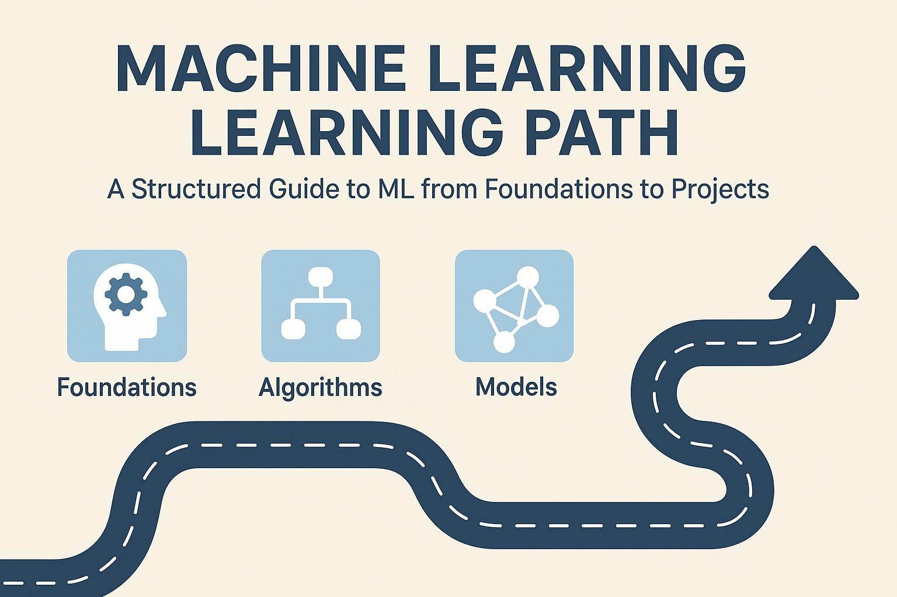

<p align="center">
  
</p>

# 📚 Machine Learning Learning Path

<p align="center">
  <a href="https://www.python.org/"></a>
  <a href="https://scikit-learn.org/"></a>
  <a href="https://www.tensorflow.org/"></a>
  <a href="https://pytorch.org/"></a>
  <a href="./LICENSE"></a>
  <a href="#"></a>
</p>

---

This repository is a structured learning path for machine learning, covering foundations, supervised and unsupervised algorithms, and deep learning with hands-on projects. It also serves as a portfolio.

## ✨ Features
- Well-structured learning path from basics to deep learning  
- Clear explanations and theory for each concept  
- Hands-on notebooks with practical implementations  
- Data visualization and preprocessing with Python libraries  
- Projects with real-world ML applications  
- Easy-to-follow repo structure  

## 📖 Table of Contents
- [About this Repository](#-about-this-repository)
- [Repository Structure](#-repository-structure)
- [Getting Started](#-getting-started)
- [Prerequisites](#-prerequisites)
- [License](#-license)
- [Contribution](#-contribution)

## 🤖 About this Repository
The notebooks introduce each concept, explain the theory, and demonstrate it with real code. Use this to:
- Understand core ML algorithms  
- Practice data handling and visualization (NumPy, Pandas, Matplotlib, Seaborn)  
- Explore supervised, unsupervised, and deep learning  
- Apply skills in projects with real datasets  

## 📁 Repository Structure
- 00_setup/ → Environment and editor setup  
  - environment.yml or requirements.txt  
  - .vscode/settings.json and .vscode/extensions.json  
  - README.md (how to set up and run)  
- 01_Foundations/ → Basics of ML, NumPy, Pandas, Matplotlib, Seaborn  
- 02_Supervised_Learning/ → Linear Regression, Logistic Regression, Decision Trees, Ensembles  
- 03_Unsupervised_Learning/ → K-Means Clustering, PCA  
- 04_Deep_Learning/ → Neural Networks, CNNs for image data  
- 05_Projects/ → Hands-on projects applying ML concepts  

## 🚀 Getting Started
Clone the repository:
```
git clone https://github.com/rohith-0099/ml-from-scratch.git
```
Open the notebooks (.ipynb) with Jupyter Notebook or JupyterLab.

## ✅ Prerequisites
- Python 3.7+  
- Jupyter Notebook / JupyterLab  
- NumPy, Pandas, Matplotlib, Seaborn  
- scikit-learn  
- TensorFlow or PyTorch  

Install with pip:
```
pip install numpy pandas matplotlib seaborn scikit-learn tensorflow jupyter
```

Or with Conda (if using environment.yml):
```
conda env create -f 00_setup/environment.yml
conda activate ml-path
```

## 📜 License
Licensed under the MIT License – see the LICENSE file.

## 🙏 Contribution
Contributions and suggestions are welcome!
- Open an issue for bugs or ideas  
- Submit a pull request for improvements  

## ⭐ Support
If you like this project, give it a star ⭐

<p align="center">
  Made with ❤️ for Machine Learning
</p>
```
